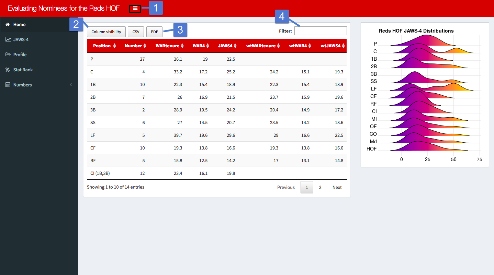

## Introduction

The purpose of this app is to provide tools to evaluate nominees for the Reds Hall of Fame. Its primary feature is the JAWS-4 statistic. JAWS-4 is a version of Jay Jaffe's JAWS statistic that's been modified to apply to a franchise's hall of fame.

The JAWS statistic is meant to be a starting point in the discussion of a nominee's creditials for the hall of fame. Jaffe provides a more thorough explanation [here](https://www.si.com/mlb/2017/11/27/hall-fame-jaws-intro-2018-ballot). There's also a more succinct description at [Baseball-Reference](https://www.baseball-reference.com/about/jaws.shtml).

Other features include a Hall of Fame score which relates a player's statistics to members of the hall of fame and player stat ranks and percentiles. Lastly, there are multiple tables to compare players in other categories like the postseason, fielding, and awards.

### Controls

For those unfamilar with shinydashboard and DataTables, there are some basic functions you should be aware of.

1.
